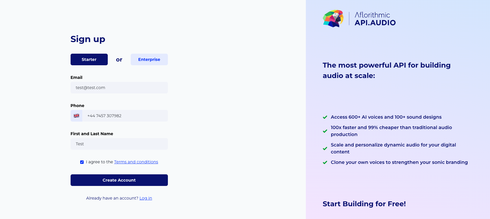

# Changelog
## Friday 25th Nov 2022
### Speech 
[Voice Cloning](https://aflorithmic.github.io/voice-cloning-api)
* We shipped an update of the voice cloning API to production - and used by users. Allowing you to whitelabel Voice Cloning. 
### Bug fixes
* We enhanced our normaliser and voice intelligence functionality -  Better pronunciation of digits and telephone numbers, telephone numbers (German)
* Media files with zero bytes were corrupted. We now report an error in the mastering endpoints. Thanks to our customers who told us about this 

## Friday 11th Nov 2022
### Speedcloning
In order to make Voice Cloning a time efficient process, we’ve developed the world’s first *Speed Cloning* feature. Where in, users can clone their voices with just 30 minutes of recording time, compared to the industry standard of 6 hours.


### Italian script :it:
We're working on multiple languages and support for various European Languages. 

We just shipped the Italian Script. In the future we'll have our first Italian voice for a customer. 

We're excited to continually invest in more languages!

### Bug Fixes
We fixed some bugs in unexpected behaviour in the SDK about media files and script and the interaction of them. This should improve your user experience. Thanks to our users for reporting these bugs, we’re happy to make our product even better!
## Friday 4th Nov 2022

### Version 1 - New Billing & Analytics in Console 

We shipped new billing analytics. We also made improvements in the backend to improve the user experience.

### De-esser !
De-essing is the process of attenuating or reducing sibilance, or harsh high-frequency sounds that come from dialogue or vocals using the letters S, F, X, SH, and soft Cs. 

It’s often a necessary process when mixing audio, but it’s rarely easy—especially when you’re just getting started. Many factors contribute to the complex nature of de-essing, from the way split-band processors can impact the character of a sound, to the manner in which the human voice can change from sibilance to sibilance.

Here's an example
```python
import apiaudio
import os
apiaudio.api_base = "https://v1.api.audio"
apiaudio.api_key = os.environ["API_KEY"]

# generate female voice with and without desser for A/B test
preset_list = ["default", "deesserfemale"]   # try male voice ex. ->  ["default", "deessermale"]   
name = "vicki"                               # try male voice ex. ->  ["brandon"]

text = f"""Hi I am {name} and this is the result of applying de-essing to my voice, she sells seashells on the seashore. Sand, sent, sink, sonar, sun"""

for preset in preset_list:
    try:
        response = apiaudio.Script.create(scriptText=text, scriptName=f"testing-{name}-{preset}", projectName = "testing")
        script_id = response["scriptId"]
        response = apiaudio.Speech.create(scriptId=script_id, voice=name)

        r = apiaudio.Mastering.create(scriptId=script_id, soundTemplate="", masteringPreset = preset) 
        print(r)

        r = apiaudio.Mastering.download(scriptId=script_id)

    except Exception as e:
        print(e)
```
We look forwarding to shipping more **audio quality** improvements like this.  
### SMS authentication 
We shipped SMS based authentication, some of our users reported issues with Email based authentication. We hope this improves your customer experience


### Bug fixing
We had a bug in our billing for updating your credit card details. This is now fixed. Sorry for any inconvenience! 


## Friday 28th October 2022
## Billing

We updated our billing functionality. Some of the improvements are backend and reliability improvements however we also wanted to share the following. 
We're introducing **starter** and **enterprise** plans. For access to Enterprise you'll need an **access code** from your 
account manager. 


And here you can see the Enterprise sign up 


We are doing this to allow easiness for the user to sign up and companies and also because Enterprise plans vary in their prices depending on your expected usage. 
## Script
Performance improvements in `script-get()`, better response times when fetching large quantities of script(s).

## Bug fixes
### Mastering
We had a bug in our `shareUrl` setup. Which meant that users weren't able to easily share audio. 
We've fixed this bug.
```python    
mastering = apiaudio.Mastering.create(
scriptId="concert-ad",
soundTemplate="house",
share=True
)
# Check the response
print('Response from mastering', mastering)

# Listen and share your audio file 
print('Listen to your audio here', mastering['shareUrl'])
```
This will get a response like
```shell
Response from mastering {'shareUrl': 'https://console.api.audio/share?id=e3b91a92', 'message': 'Mastering completed successfully', 'url': 'https://v1.api.audio/url/aaecb3/concert-ad__band~nickelback__city~berlin.mp3', 'warnings': ''}
Listen to your audio here https://console.api.audio/share?id=e3b91a92
```
Where the key url for the share functionality is `https://console.api.audio/share?id=id_1`
You can see how it looks here


### JS SDK
* We updated the Javascript SDK 
## Friday 16th Sept 2022
## Organisation methods
- `get_org_data()` - Get organizations data, including orgId, orgName etc.
  - Parameters:
    - None.
  - Example:
    ```python
    org_data = apiaudio.Organization.get_org_data()
    ```
- `list_child_orgs()` - List your child organizations.
  - Parameters:
    - None.
  - Example:
    ```python
    child_orgs = apiaudio.Organization.list_child_orgs()
    ```
- `get_secrets()` - Get your api key, webhook url and webhook secret.
  - Parameters:
    - None.
  - Example:
    ```python
    secrets = apiaudio.Organization.get_secrets()
    ```

## Script enhancements
### BREAKING CHANGES

### Script.list()

**-> must supply project name to list by module**
**-> must supply project name, and module name to list by script name**
**-> cannot give a project name, module name, or script name a name beginning with _**


## NEW features

### list methods
```apiaudio.script.list_projects() OR (GET) /script/list_projects```

Will list all the projects within your organization

```apiaudio.script.list_modules() OR (GET) /script/list_modules```

Will list all the modules within your organization. The values returned will be in the format `<project_name>/<module_name>`

```apiaudio.script.list_script_names() OR (GET) /script/list_script_names```

Will list all the scripts within your organization. The values returned will be in the format `<project_name>/<module_name>/<script_name>`

### delete methods

```apiaudio.script.delete_multiple() OR (DELETE) /script/scripts```

Deletes multiple scripts from a project/module/script. Must supply project name to delete by module (etc)

### verbose list

You can now supply verbose=false to script list ```resB = apiaudio.Script.list(projectName="x", verbose=False)``` this will only supply scriptId's and PMS names in the response

### TODO next time
listing all scripts returns a pagination token (limited to a 1000 at a time)

## Bug fixing 
### Some unicode errors in some voice providers
One of our customers provided a bug report for some unicode characters. We fixed this with specific voices. So now you should be able to use all voices with unicode.
The example is shown below the ellipsis. 
```python
text = """Just being transparent… """
```
### Pricing
We updated some of our pricing to be more in line with the api pricing page. You can see it here [https://docs.api.audio/docs/api-pricing](https://docs.api.audio/docs/api-pricing)

## Friday 9th September 2022
### Voice Cloner SDK
* [https://github.com/aflorithmic/apiaudio-python/pull/121](Voice Cloner SDK) - 
* SDK's readability and the accuracy of API's representations (object members annotations in IDEs!),
* testability (proper client tests, increased probability of catching breaking changes),
* simplicity of version-specific changes (e.g. SDK-side transformations, API-side version-specific feature flags, extra keys ignored in previous versions etc.) 

### New voices
* We now have over 600 voices! Improving our customer experience.
* We introduced a new partner [DeepZen](https://www.aflorithmic.ai/post/welcoming-new-deepzen-voices-into-api-audio-by-aflorithmic) which have amazing emotive voices. Give them a try :) 
* You can listen to them [here in the library](https://library.api.audio/voices?providerFullName=deepzen)

### Better voices
We recently migrated our ML platform from an old platform to a new platform. (Older version of kubeflow to newer version of kubeflow)
We've rolled the out to all customers. 

This has a bunch of advantages 
* Running on a well-maintained distribution (by AWS) so easier to developer - enabling faster feature delivery
* AWS Services better integrated - more reliable
* Fixed our security vulnerabilities - because we care about customer trust (this also addresses Log4J issues [we had](https://logging.apache.org/log4j/2.x/security.html))
* New inference API, faster inference - faster voices
* We’re able to roll out faster, more reliable, and do more frequent updates. Enabling us to develop better features, faster
* The deployment is way easier (we created a python package) 
* Our ML team is able to access logs from the dashboard, so able to fix bugs faster :)


## Friday 2nd September 2022
## Voice builder
We improved our voice creation capabilities so we did automatic voice preview. We have automatic preview of files, as soon as the model finished training, and proper status updates. This enhances the customer experience in our ability to deliver great voices. 


## Connectors
Our connectors functionality, got a redesign. This redesign means adding new connectors will be much faster!

## Next week
We've got some awesome voice improvements coming, and a much better voice cloning experience.

## Friday 19th August 2022
## SuperOrg update
* We've been working on improvements such as showing you the child orgs in your super org,
and allowing you to click through to the child org from your console.

## Voice Cloner
* We shipped a new alpha release of Voice Cloner, a much more improved process and faster time to your first voice.

## Docs
* [Getting started](https://docs.api.audio/reference/getting-started-with-the-api) we revamped the reference part of the API docs.


## Friday 12th August 2022
## Docs updates
We launched a [Discussion](https://docs.api.audio/discuss) so as you can ask us your questions directly. In addition to that, we have also launched an updated FAQ Page [FAQs](https://docs.api.audio/discuss?isFAQ=true)

## Pronunciation Dictionary (Lexi)
We updated our Dictionary feature - to make it even more user friendly.
We call our Dictionary feature - Lexi.
```python
# correct the word sapiens
r = apiaudio.Lexi.register_custom_word(word="sapiens", replacement="saypeeoons", lang="en")
print(r)
```

You can also look at this longer example below
```python
text = "hello I am in the city of <!reading> today. My name is Sam - and lexi is live in production. Try it out at aflorithmic."

# register two words in our custom dicts
r = apiaudio.Lexi.register_custom_word(word="Sam", replacement="hackerman", lang="en")
print(r)
r = apiaudio.Lexi.register_custom_word(word="lexi", replacement="lexi a k a the awesome word replacement machine", lang="en")
print(r)

# list all our dicts
r = apiaudio.Lexi.list_custom_dicts()
print(r)

# list words in our en dict
r = apiaudio.Lexi.list_custom_words(lang="en")
print(r)

# usual api stuff
script = apiaudio.Script.create(scriptText=text)
print(r)
r = apiaudio.Speech.create(scriptId=script["scriptId"], voice="sara", useDictionary=True)
print(r)
r = apiaudio.Speech.download(scriptId=script["scriptId"])
print(r)

# we can delete words also!
r = apiaudio.Lexi.delete_custom_word(word="sam", lang="en")
print(r)
```

We love hearing what you'll build.
## Friday 5th August 2022
## Docs updates
We've been listening to our user feedback about our docs and we've made some changes
* [Welcome](https://docs.api.audio/docs/welcome) Our welcome page is clearer and more benefits driven
* [Dynamic Versioning](https://docs.api.audio/docs/one-script-several-different-versions-of-speech) We made our example easier to learn and adopt
* [Roles and Permissions](https://docs.api.audio/docs/super-organisation) We launched a NEW page with an explanation of our Roles and Permissions functionality.
* [Webhooks](https://docs.api.audio/docs/webhooks) We use webhooks to notify your application when an event happens in your organization. Webhooks are particularly useful for asynchronous events like when producing audio files that take a long time to process. This was requested by customers as well :)

## Voice capture app
* Within our Voice Capture App, we have invested into improving the performance of our backend processes, particularly enhancing the customer experience. It's available to select users here[Voice Cloning](https://voice-cloning.api.audio/)

## Bug fixes
* We fixed a phoneme compatibility bug in Visemes - it wasn't working with all inputted phonemes- If you want to access this feature and you are in the avatar business, please get in touch to discuss!
## Performance enhancements
* We optimised our Voice Intelligence feature to be 3x faster. Have fun using it :)

## Friday 29th July 2022
## Updated pricing policy
After careful discussion with our wonderful customers, we decided to update our pricing policy. We did this to make things *simpler* and we also connected price more to value.

WHAT HAS CHANGED?
* Instead of 5 tiers we now only have 4. The enterprise plan is now a fully managed service and can be found on Aflorithmic.ai.
* FREE plan - This is a free trial period of 30 days, granting you 250 production credits to get your feet wet.

* INDIE plan - At just $39 per month you can start building your own audio production environment without a watermark and including 1,100 production credits per month.

* PRODUCTION plan - If you are a developer with a commercial project in mind, this is the plan for you. With 8,000 production credits and at a lower additional cost per credit it’s designed to build a lot.

* PROFESSIONAL plan - This plan is for organizations with a lot of tech muscle who still want to stay in full control of their product, but don’t want to move to an enterprise plan yet. Literally anything can be customized.

You can read more here in the [Pricing email](https://mailchi.mp/aflorithmic/filter-400-ai-voices-meet-us-on-our-roadshow-5857331?e=0acb1efcc4)

## Documentation improvements
* We've been working hard on our docs lately. One improvement we're proud of is the new [Quickstart](https://docs.api.audio/docs/quickstart) which will help you produce beautiful audio in minutes.

## Voice enhancements
* Some customer voices reported issues with loudness, we've deployed these to some of our `messner` voices (available on some of our plans) and will continue to deploy these changes. This enhances the acoustic quality of the voices and improve their naturalness to almost human-like!

## New payment methods
Some of our customers remarked to us that they wanted to Pay in their existing method. So we this week we added thanks to our partners at [Stripe](www.stripe.com) a whole range of new payment methods.
These include
* SEPA Direct Debit
* BACS Direct Debit
* iDEAL
* EPS
* Giropay
* Bancontact
* Carte Bancaire

This is on top of Google Pay, Apple Pay and Card that we already offer.


You can even see the payment method in your local currency

And if you're in some parts of the Eurozone you'll see

We hope this helps you pay us the way that you want. And helps us add more value to our customers.
## New voice category
* We now have a new category in our library, and it's called Character.  it is mainly gaming voices/effected voices. Please have a listen [Character link](https://library.api.audio/voices?gender=character) and let us know what you think!
## Sound Templates upload
Users often want the ability to handle and upload sound templates themselves - especially if you've got the creative ability. This feature allows you to manage and upload sound templates.
(Needs more explanations)
## Bug fixes
* We fixed a bug in our urls for sharing audio, so your shared content now works for up to 7 days. Thanks to those who helped discover and fix that bug!

## Friday 22nd July 2022
### Normaliser
We're working on our normaliser and we'll be rolling out some changes next week. This will allow the likes of `cm` to be pronounced correctly and also will work for dates and some times.

This only works with German, so we're sorry if you don't read that. But we're a big believer in supporting many languages :) In fact we have over 50 languages supported.
```python
import os
import apiaudio
apiaudio.api_key = os.environ["API_KEY"]

some_text = """
Die Größe des Täters wurde mit 2 cm angegeben. Im August wurde es über 2 °C warm. Die Strecke ist 234 km lang. Meine Schuhe wiegen nur 300 gr.
Mit über 18,1 Kg ist der Fernseher ein echtes Schwergewicht. Die neuen LCD Bildschirme arbeiten mit 100 hz. All diese Geräte arbeiten mit 110 V.
Der Heizstrahler hat eine Leistung von 300 W. Um circa 14:43 Uhr ereignete sich der Vorfall. Das ganze fing schon um 3:22 an. Ab 9.00 Uhr ist angezapft. Mit nur 30 min ist das Meeting eher kurz. Putin hat sich in einer Rede in die Tradition von Zar Peter dem Großen (1988-2002) gestellt. Am 31.10.1982 fand das Event statt. Das war am 02.04.2021. In der Umfrage sagten 1/3 der Befragten das Gleiche. Sie brauchen ¼ Tasse Wasser. Das Glas Bier kostet 3,30€. Der Meter Fichtenholz kostet 0,46€. Das Glas Fanta kostet 1,95 EUR. Das Glas Cola kostet 1,40 EURO. Und ein Kasten 12,00 euro. Alles Weitere kommt mit 0,03 euro noch hinzu. Davon zog er noch 4,03 eur ab. Apple berechnet dafür in den USA 1290$. Microsoft jedoch nur 34,43 USD. Den Deal zahlte er demnach pro Gramm – soll er jedenfalls. Es handelte sich um 5.550 Männer und 5550 Frauen. jetzt bei scout24.com. Es gab 200 Lieferanten. Und 900 Liefer, Anten. Peugeot. Drogendealer.
"""

VOICE="lena"
#you can change this to another German voice such as 'erika','bernd' or'greta'
script = apiaudio.Script.create(scriptText=some_text)
r = apiaudio.Speech.create(scriptId=script["scriptId"], useTextNormaliser=True,   voice=VOICE)
print(r)
apiaudio.Speech.download(scriptId=script["scriptId"])
    os.rename("default__section~1of1.wav", f"{VOICE}_with_norm.wav")
```
And the various acronymns and currencies and dates will all be correctly pronounced. This improves the user experience big time in our tests.
### German voice capture and voice deployment
We've been working hard on our German voice capture through our *Voice cloner* app and also improving our ML pipelines. Our beta customers love our new voices - they score highest in our tests that we've ever built. If you're interested in cloning your voice in German please reach out to bjoern[at]aflorithmic.ai to discuss cloning your voice for your brand.

### Improved customer experience
At Aflorithmic we try every day to "delight our customers" and so we've been investing in our monitoring, bug tracking and understanding the workflows of our users. We want to mention just one improvement - and there's many others in the background.
* We've been working on better monitoring and understanding bugs for our users, so we recently launched a new system for better monitoring and reproducing errors. This will help us respond better to you and your queries.

### Bug fixes
* We've fixed a few performance bugs in mastering builder, these are incremental changes and you might not notice the difference, but the journey to a world-class product is built upon incremental customer centric change :)

* One customer reported an issue with our [https://console.api.audio/voice-cloner](Voice Cloner Tab) it turned out that this wasn't loading if you have lots of scripts stored, we improved the performance and fixed this issue. This only affects some plans - Corporate in particular.

* We fixed some bugs with `Tax Collection Id` was not being accepted for some users when signing up with stripe. We're very sorry for this problem and any issues it caused with your upgrading accounts.

### Billing enhancements - coming next week
We've made some billing enhancements and improving to our billing systems. We'll ship this next week.
## Friday 15th July 2022

### OpenAPI
* We launched [OpenAPI](https://aflorithmic.github.io/openapi/) so you can see in [Swagger](https://swagger.io/) style our endpoints. If you're used to this workflow let us know we'd love to talk some more about it. Feel free to reach out to peadar[at]aflorithmic[dot]ai

### SuperOrg
A common customer request was - I want to understand what my customers usage is. For example if you're a distribution partner or agency you'll encounter this workflow.

This allows you to see usage of your child organisations :) Have a look below. It's in production so you can try it out!

### SyncTTS
* When you use syncTTS with `metadata=True` there will also be a url generated

```python
response = apiaudio.SyncTTS.create(text="Hello", voice="shelly", metadata=True)
```

```python
{
    "audio_data": string, # base64 encoded
    "url": string,
    "sampling_rate": string,
    "event_data": [
        {
            "phoneme": string,
            "viseme": string,
            "offset": float,
            "duration": float
        }
    ]
}
```
### Bug fixes
* One customer reported some unicode issues with non-latin based alphabets. We're sorry for this error and we've fixed it for a range of languages including Arabic, Telugu and Greek. If you find any issues like this let us know.

* **Breaking Change** Since 4th of July, when using certain sound templates in conjunction with mastering section properties, resulted in sections that were in-fact to long. We've fixed these errors and this is already shipped. This will improve your experience, but you may notice some differences with behaviour of our mastering engine.

## Wednesday 13th July 2022
* We added two features to `syncTTS` resource:
  * Retrieve URL to audio instead of raw data (Note: size limits don't apply in this case!):
  ```python
    dictionary = apiaudio.SyncTTS.create(
        text="Hello, how are you?",
        voice="joanna",
        url=True
    )
    url = dictionary["url"]
  ```
  * Specify format of audio (currently supported formats are: "mp3", "wav", "pcm"):
  ```python
    mp3_bytes = apiaudio.SyncTTS.create(
        text="Hello, how are you?",
        voice="joanna",
        format="mp3"
    )
  ```

## Friday 8th July 2022

### New Voices
* We added one of our Partners [Cereproc](http://www.cereproc.com) you can see the voices [here](https://library.api.audio/voices?providerFullName=cerevoice)
* You can try out a voice from Cereproc with this example
```python
import apiaudio
apiaudio.api_key="API-KEY"
script = apiaudio.Script.create(scriptText="<<soundSegment::intro>><<sectionName::intro>>Hello world. Welcome to API dot audio.<<soundSegment::main>><<sectionName::main>> Create audio in a few easy steps.")
response = apiaudio.Speech.create(scriptId=script.get("scriptId"), voice="dakota")
response = apiaudio.Mastering.create(scriptId=script.get("scriptId"), soundTemplate = "parisianmorning" )
file = apiaudio.Mastering.download(scriptId=script.get("scriptId"))
```

### Console
We've been updating the console a lot.
You can see some images here of Get Started

You can see the changelog here


### Voice cloner
* We shipped a new version of [voice cloner](https://voice-cloning.api.audio/capture)
* This is up to a 3X faster User Experience.

### SuperOrg

* We improved superorg and integrated billing. So child orgs API consumption now contributes to your bill. And we added metering and analytics (you'll need to contact matt@aflorithmic.ai for that)


* SDK support for superorgs and all assuming mechanism. Both for JS and Python sdks. [See the SDK here](https://github.com/aflorithmic/apiaudio-python#super-organizations)

### Billing
We've optimised our pricing for usage.
* 250 free credits on sign up, instead of 500.
* Monthly allowance for free plans, instead of giving them time till the end of month regardless what day
they signed up. This way, free organisations will have 28 days to use their credits. We will add some email
marketing about this as well.

## Friday 1st July 2022
### Voice cloner update
- UX improvements
- Bug free :)
- Setup page
- Silence detector (hands free operation)
- AES version 2 - better UX for our customers (threshold adjustments)

How can I get started?
You'll be able to sign up with [https://voice-cloning.api.audio/](Voice-cloning)

### Webhooks
- We're delighted to ship a much requested feature from customers! *Webhooks*
- If you're looking for a good explanation of webhooks we recommend [this blog post](https://zapier.com/blog/what-are-webhooks/) but basically these are automated messages (akin to SMS) sent from APIs when something happens in an API. A common use case for us is mastering requests. Some mastering requests take some time to run, so you may want to simply set these up with webhooks and have a better customer experience :)
You can see some image here

You'll receive the logs of the webhooks here


Here's some code as well. Let's say you have a long running mastering request. It might take 30s.
Rather than waiting for the request to run - you can simple add a callback url.

```python
apiaudio.Mastering().create(scriptId=script_id, callback_url='call-based callback url')
```

We also have some awesome security features such as verifying signatures. We'll add more to the docs about this soon.
```python
apiaudio.Webhooks.verify(event_body, x-aflr-secret, clients_webhook_secret, tolerance = defaults to 300 seconds)
```
### Enhanced Watermarks
- Our free plan has watermarks, if you want these removed you'll have to upgrade. We've added these to multiple languages.
Here are some examples
```shell
WATER_MARKS = {
    "default" : ". Created with API audio.",
    "en" : ". Created with API audio.",
    "pl" : ". Stworzone przy użyciu API audio.",
    "ga" : ". Cruthaithe le fuaim API audio",
    "tr" : ". api.audio ile oluşturuldu",
    "fr" : ". créé avec API audio",
    "ca-es" : ". creat amb API audio",
    "ca" : ". creat amb API audio",
    "el" : ". Δημιουργήθηκε με το api.audio",
    "nl" : ". Gemaakt met API audio",
    "de" : ". Erstellt mit api punkt audio.",
    "pt-br" : ". Criado com api.audio",
    "pt" : ". Criado com api.audio",
    "hu" : ". Az api.audio felhasználásával készült.",
    "et" : ". valmistaja Api audio",
    "hi" : ". yeh aawaaz api audio se banayi gayi",
    "zh" : ". 用Api audio製作的",
    "ua" : "створено за допомогою API крапка аудіо",
    "bn" : "API অডিও দিয়ে তৈরি করা |"
}
```

### SuperOrgs added to the console
- We're going to add to the console the SuperOrg functionality enabling users to administer functionality for the companies that are using their accounts.
- There's a lot more fine grained control coming as well, but this is an *enterprise ready* feature and requested by numerous customers. If you want a demo feel free to reach out.


### Visemes 2.0
Online (sync) Visemes 2.0: We have onboarded all of our customers' feedback, and we are now confident to launch a new version, the result of 3 months of R&D. There are substantial improvements in alignment, speed and latency. They are deployed in our custom `msnr` voices

### Bug fixes
- Some customers reported that the amplitude of some of our `msnr` voices was louder on the
second sentence and not the first sentence. We created a fix for this, and we hope this fixes the error.

### Coming soon new partnerships
- We have new partnerships for our beta customers please reach out to us to learn more to try out new voices.

## Friday 24th June 2022
v.0.16.3
### SuperOrg
- Listing superorgs - the ability to list these organisations.
- Billing integration so each superorg and child org is charged correctly.

### Voice Cloner
Our Data Capture App used as part of our voice cloning process is now rebranded *voice cloner*

These are the top bug fixes this week which should result in a much better user experience
* Microphone not detected on some Mobile Phones. (Fixed)
* Play button not playing back full audio. (Fixed)
* “Record” button wasn’t recording full sentences. (Fixed)
* AutoGain was causing distorting in audio (Fixed)

You can try it out here [Voice Cloner](https://voice-cloning.api.audio/)


### Bug Fixes
- We fixed a bug that was showing hidden voices in the voice library. This was hurting the user experience.

### German Voice
- We've shipped the following to select Beta customers. If you want access let us know and we'll give you access.
It's our best voice ever created by our internal TTS research team - it's called `margareta-v1`
```python
# script text
text = text = """
Hallo Peadar. Ich wurde am 20.06.2022 in der Softwareschmiede von Aflorithmic in Produktion eingesetzt.
"""
# script creation
script = apiaudio.Script.create(scriptText=text, scriptName="breaking_news")


r = apiaudio.Speech().create(
    scriptId=script.get("scriptId"),
    voice="margareta-v1",
    speed=110,
)

template = "breakingnews"
response = apiaudio.Mastering().create(
    scriptId=script.get("scriptId"),
    soundTemplate=template
)

print(response)

file = apiaudio.Mastering().download(
    scriptId=script.get("scriptId"), destination=".")
print(file)
```
You can listen to an example here <video src="https://user-images.githubusercontent.com/983944/175528852-84d5dc2e-3780-4642-9d87-fccb8facab48.mp4
"></video>

### Bug fixing
- We discovered an incorrect billing issue with some voices on our platform (only affecting IBM voices). This only impacted some customers all customers have been informed and refunded. We've added alarms and detection mechanisms and enhanced quality control to fix this going forward. We're sorry for any inconvenience.
- We're implementing changes to handle this and working on our reliability and monitoring.


### Console updates
We've been working hard on our console in the recent weeks. And you can view it [here](https://console.api.audio/)
You can see the easier view of Total api calls, Script api calls, Speech api calls and Mastering api calls

If you click on these you'll see some other information including this *awesome* donut chart

And if you want to dive deep into this have a look here at the logs


These are just some highlights of the stuff we've improved based on customer feedback :)
## Friday 17th June 2022
  v0.16.2

### Enhancements

- We introduced a new function called `set_assume_org_id` for incoming super organization feature. By using this method, you can assume the id of a child organization as their super organization, and make your calls on behalf of them.

A super organization is loosely modelled on superuser. So you can as a company ACME have specific criteria and permissions - and then you can share these with your child organisations. This allows you fine grained control of users and their roles and permissions and the ability to share settings and voices across orgs. We were informed by IAM from AWS in our design. If you want access let us know, we're working hard on this. This is part of a whole

- *Voices* We have some great partnerships coming up with 2 new voice providers. Reach out to us if you want to know more :)
### Coming soon
Under msnr we will soon have another german voice. We're testing this with some beta customers the `margareta-v1` voice.
(Updated above)


We've also improved our performance and invested more in

## Friday 20th May 2022
  v0.16.1

### Bug fixing

- We noticed in testing some additional latency caused by our feature flag implementation - so we refactored this to make it much faster. This was mostly visible in our custom voice implementations.

### Enhancements

- We added the ability to share audio with other users. It's a magic link feature.
  For example

```shell
curl -X POST \
  'https://v1.api.audio/mastering' \
  --header 'x-api-key: API-KEY' \
  --header 'Content-Type: application/json' \
  --data-raw '{
    "scriptId": "xx",
    "share": true
}'
```

This returns a url - if you goto

https://console-api.audio/share?id=your_id

You'll get a page that you can share with your organisation and via Whatsapp and other social
networks.

- We've updated our [voice library page](https://library.api.audio/voices) to have faster loading and we've added some other improvements in the GET request for voices so you can have a better voice discovery experience. Most of this is backend and performance enhancements.
- Enhanced query parameters for voice discoverability

`GET https://v1.api.audio/voice?tags=upbeat,storytelling`

Will voices that have both of these tags. We also introduced pagination as well.

**Pagination**
(Not yet available in the SDK)
Use parameter `limit` to set the amount of returned voices. Use `offset` to iterate through the results.

E.g.

`GET https://v1.api.audio/voice?limit=10&offset=10`

`GET https://v1.api.audio/voice?limit=10&offset=20`

`GET https://v1.api.audio/voice?limit=10&offset=30`

**Query body in POST /voice**

A `query` JSON is available in POST method.

**Supported operators:**

> `"$gt", "$gte", "$lt", "$lte", "$contains", "$is_in", "$ne"`

**Basic query (attribute equals x):**

```json
{
  "query": {
    "language": "english",
    "provider": "polly"
  }
}
```

**List specific languages:**

```json
{
  "query": {
    "language": {
      "$is_in": ["english", "spanish", "polish"]
    }
  }
}
```

**List only private and public_paid tiers:**

```json
{
  "query": {
    "tier": {
      "$ne": "public"
    }
  }
}
```

**List spanish voices where priority is less than or equal to 3:**

```json
{
  "query": {
    "language": "spanish",
    "priority": { "$lte": 3 }
  }
}
```

There's a lot you can do with this so we hope this makes your develper experience easier.

### New released features

- Enhancements of voices. We've been testing with some users a more natural pauses to our custom voices. We contacted customers affected and some requested to not have this feature enabled please contact us if you want to use the old voices. We do feel that these voices are more natural and our beta testing was positive. These will be available soon under `msnr` voices in our API.

- As a developer user I want to share my audio with my team/bosses/business person so they can try and test the wonders of api.audio. We call this _virality link_ and it's available in the console soon.

## Friday 13th May 2022

v0.16.0

### Features

- We added new endFormat (for making sure your audio is the correct format for a target audience) this week we added Alexa preset

```python
 m = apiaudio.Mastering().create(scriptId=GLOBAL_SCRIPT_ID, endFormat="mp3_alexa")
```

In the future we will add other endFormats - please tell us which ones you'd like.

- To continue to be able to offer free content to those of you still getting to know API.audio, we have added a watermark to our files.

### Corporate features

- For our corporate plan users we've enabled `sandboxing` this allows you to test safely API requests without using up credits. Please contact your account manager for further details.

### Breaking Changes

- Our feature (pronunciation dictionary) has had some usability enhancements. The biggest change is adding `useDictionary` as a boolean.
  Here's an example
  ```python
  scriptText = """Hello I am reading a book in the city of <!location>reading<!> today"""
  script = apiaudio.Script.create(scriptText=scriptText)
  speech = apiaudio.Speech.create(scriptId=script["scriptId"], voice="Ryan", useDictionary=True)
  print(speech)
  ```
  The addition of useDictionary and the change in behaviour is likely to present some breaking changes. We've notified any customers who are affected.

### Bug Fixing

We had some third party downtime with some voices from one provider. We notified them and fixed this issue.

### Maintenance

We have removed old code and streamlined other code using our Mastering engine. This will allow us to add features more easily whilst removing unnecessary complexity.
We also made various performance improvements and work in the background. Although not all of this will be customer facing, these incremental improvements are very important.

### Unreleased

(These are features that aren't added yet, but will be released next week)

- Enhancements of voices. We've been testing with some users a more natural pauses to our custom voices. We contacted customers affected and some requested to not have this feature enabled please contact us if you want to use the old voices. We do feel that these voices are more natural and our beta testing was positive. These will be available soon under `msnr` voices in our API.

- As a developer user I want to share my audio with my team/bosses/business person so they can try and test the wonders of api.audio. We call this _virality link_ and it's available in the console soon.

- We've been developing the usability of our data capture app for voice cloning (this is available in some plans). You'll see this in the next few weeks.
